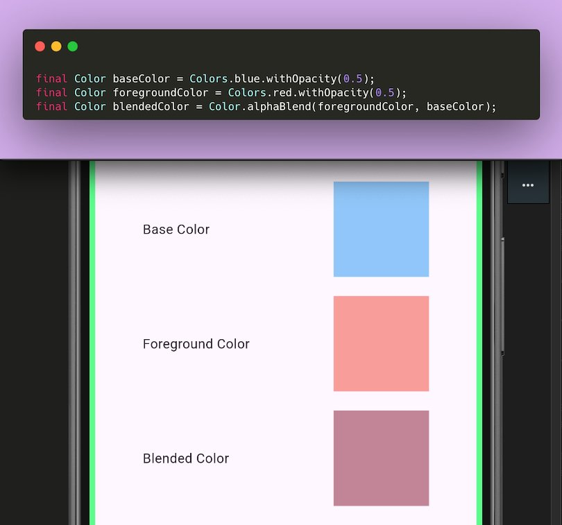

# Layering Colors

You can use the Color.alphaBlend method to layer one color on top of another. This is useful when you want to create a new color that is a blend of two other colors.

```dart
final Color baseColor = Colors.blue.withOpacity(0.5);
final Color foregroundColor = Colors.red.withOpacity(0.5);
final Color blendedColor = Color.alphaBlend(foregroundColor, baseColor);
```

